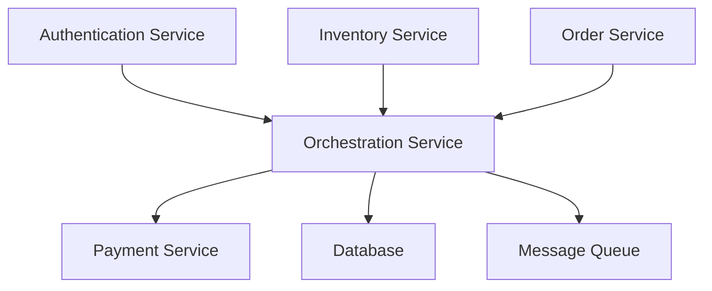

# Microservices E-commerce Platform

[](https://github.com/yourusername/microservices/releases)


A modern, scalable e-commerce platform built with microservices architecture. This system implements various architectural patterns and best practices to ensure high availability, scalability, and maintainability.

## 📋 Table of Contents

- [Features](#-features)
- [Architecture](#-architecture)
- [Services](#-services)
- [Tech Stack](#-tech-stack)
- [Getting Started](#-getting-started)
- [Development](#-development)
- [Monitoring](#-monitoring)
- [Security](#-security)
- [Contributing](#-contributing)
- [License](#-license)
- [Support](#-support)

## ✨ Features

- 🔐 Secure authentication and authorization
- 📦 Real-time inventory management
- 🛒 Order processing and tracking
- 💳 Secure payment processing
- 🔄 Event-driven architecture
- 📊 Comprehensive monitoring
- 🔍 Distributed tracing
- 🚀 Scalable and maintainable

## 🏗 Architecture

The system follows modern microservices architecture patterns:

- **Saga Pattern** for distributed transactions
- **CQRS** for optimized read/write operations
- **Event Sourcing** for reliable event tracking
- **Circuit Breaker** for fault tolerance
- **API Gateway** for request routing
- **Service Discovery** for dynamic service location
- **Event-Driven Architecture** for async communication

### System Architecture



## 🚀 Services

| Service | Tech Stack | Description |
|---------|------------|-------------|
| Authentication | .NET Core | User authentication, JWT, OAuth 2.0 |
| Inventory | Go | Product inventory, stock management |
| Order | Python/FastAPI | Order lifecycle management |
| Orchestration | Python/FastAPI | Service coordination, API Gateway |
| Payment | Python/FastAPI | Payment processing, transactions |

## 🛠 Tech Stack

### Backend
- **Languages**: Python, Go, .NET Core
- **Frameworks**: FastAPI, Gin, ASP.NET Core
- **Databases**: PostgreSQL, MySQL, MongoDB, Redis
- **Message Queue**: RabbitMQ, Kafka
- **Search**: Elasticsearch

### Infrastructure
- **Containerization**: Docker
- **Monitoring**: Prometheus, Grafana
- **Logging**: ELK Stack
- **Tracing**: Jaeger

## 🚀 Getting Started

### Prerequisites

- Docker and Docker Compose
- Python 3.8+
- Go 1.16+
- .NET Core 6.0+
- Node.js 16+

### Quick Start

1. Clone the repository:
```bash
git clone https://github.com/yourusername/microservices.git
cd microservices
```

2. Set up environment variables:
```bash
cp .env.example .env
# Edit .env with your configuration
```

3. Start the services:
```bash
docker-compose up -d
```

4. Access the services:
- API Gateway: http://localhost:7001
- Swagger UI: http://localhost:7001/docs
- Grafana: http://localhost:3000
- Jaeger: http://localhost:16686

## 💻 Development

### Local Development

1. Set up development environment:
```bash
./scripts/setup-dev.sh
```

2. Run tests:
```bash
./scripts/run-tests.sh
```

3. Start development services:
```bash
docker-compose -f docker-compose.dev.yml up
```

### Code Style

- Follow language-specific style guides
- Use pre-commit hooks for code formatting
- Run linters before committing
- Write unit tests for new features

## 📊 Monitoring

- **Metrics**: Prometheus + Grafana
- **Logging**: ELK Stack
- **Tracing**: Jaeger
- **Alerts**: AlertManager

## 🔒 Security

- JWT-based authentication
- OAuth 2.0 and OpenID Connect
- Role-based access control
- Encryption at rest and in transit
- Regular security audits
- DDoS protection

## 🤝 Contributing

1. Fork the repository
2. Create your feature branch (`git checkout -b feature/amazing-feature`)
3. Commit your changes (`git commit -m 'Add amazing feature'`)
4. Push to the branch (`git push origin feature/amazing-feature`)
5. Open a Pull Request
